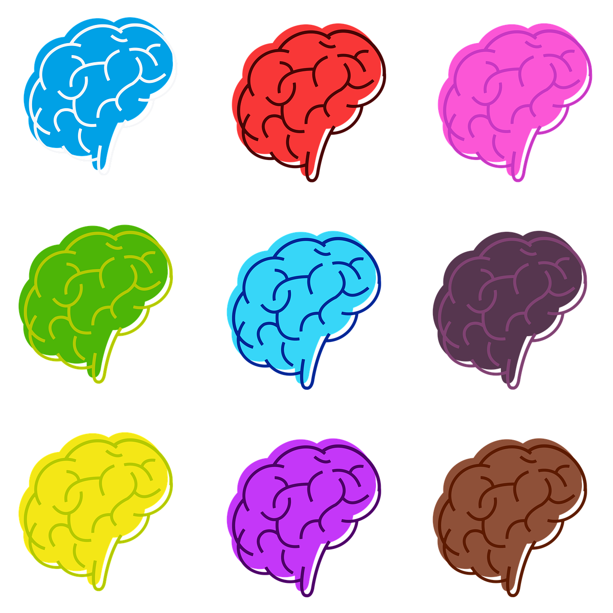

# PETMR tools - easy processing of PET/MR data for academic projects
  
  

    

> A collection of scripts assisting in the registration and processing of medical images acquired using a hybrid PET/MR platform for academic/research purpouses. Not for clinical use. Currently in early stages of development.

### File Compatibility: 
  - DICOM (.dcm) file input supported
  - Supports saving to DICOM (.dcm) format
  - Supports saving to .nifti.gz format

### Prerequisites 📋

Python module requirements detailed in "requirements.txt" file

## Author

👤 **Michael Maddalena**

* Github: [@erz-7](https://github.com/erz-7)

## Show your support

Give a ⭐️ if this project helped you!

## 📝 License

Copyright © 2023 [Michael Maddalena](https://github.com/erz-7). 
This project is [MIT license](https://mit-license.org/) licensed.